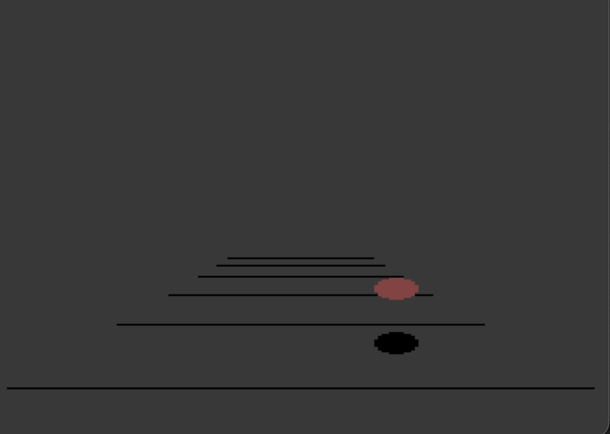

# ballsong
Recovered source code of an early version of Ball Song by Valerie Atkinson and Douglas Crockford - Atari Sunnyvale Research Laboratory - dated 1983-12-18.

Ball Song (Nr. 1 and Nr. 2) is a pair of well-known demos for the Atari 8-bit computers that play music while a ball bounces around the confines of a room. This appears to be an early version of the demo: it includes the room and the ball, but a bouncing noise instead of music; and the bouncing patterns are simpler.

This was recovered in 2026 from floppy disk given by Bob Fraser, who had worked at the Atari Sunnyvale Research Laboratory. The data recovery was done by Kay Savetz.

Included here is Ballsong_original.atr (the original disk as recovered) and Ballsong_with_SynAssembler.atr, a slightly modified version for easy assembly in SynAssembler. 

To run the demo, set your Atari emulator to Atari 800 with OS B. Boot Ballsong_original.atr. Type DOS. At the DOS menu, type L followed by the return key. Type BALL.OBJ followed by the return key.

Also included for context are the released versions of Ballsong 1 and 2, as XEX files, these are downloaded from https://a8.fandal.cz/detail.php?files_id=109 and https://a8.fandal.cz/detail.php?files_id=123
